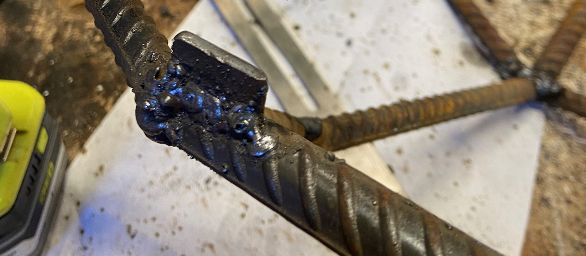

# Rebar Heart

Inspired by [Jiří Praus](http://www.jiripraus.cz/)'s [beating LED heart](https://www.instructables.com/Beating-LED-Heart/) and my desire to spend more time welding, I built this heart sculpture. 

The heart is made of 1/2" rebar, with an Adafruit NeoPixel strip driven by a Raspberry Pi. 

Is it a little cheesy? Sure, it's a giant heart that lights up with silly animations! But it's a fun beginner-level project in welding, electronics, and programming. I had a great time making it, and I hope this write-up helps you with your own project. 

Safety note: _Welding, metalworking, and electricity are all dangerous. Please take all necessary safety precautions._

## Overview

These are the steps:

1. Design and mock up the shape
2. Fabricate it
3. Attach the LED strip
4. Program the animations
5. Mount it

## Design

I did not have a concrete design in mind, and the shape evolved as I worked on it. 

I started with modeling clay to get a sense of the basic shape I wanted and used aluminum wire to try out different arrangements. 

Then I made a slightly larger mockup with bamboo skewers and hot glue to validate the shape. 

Once I was happy with the mock-up, I measured each segment with digital calipers to determine the length of the perimeter and guide the fabrication process. 

The last big decision to make was the overall size. Aiming for something in the 30-36" range, I chose the final dimensions by scaling the perimeter of the mockup to 10 feet, which is about the length of one piece of rebar stock. With that ratio, I scaled the rest of the caliper measurements to the steel dimensions in a spreadsheet. 

## Fabrication

### Welding

Rebar (reinforcing steel) is a great choice for projects like this because it's cheap, it's easy to obtain at big box home centers and building suppliers, and it's easy to stick weld. I also like the look of it. _Be sure to use plain carbon steel rebar, not galvanized: welding galvanized metal is hazardous._ 

Standard welding and metalworking tools are needed: 
 * Welder, electrodes, safety gear, fire extinguisher
 * Grinder:
   * Angle grinder with flap disc to clean up welds
   * Belt grinder to remove sharp edges on each piece. You could use the angle grinder, but a belt grinder is more convenient.
 * Wire brush to clean the rebar, like a wire cup brush for a drill
 * Something to cut the rebar, like a metal bandsaw or a cutoff wheel in the angle grinder
 * Marker and tape measure

I dove right into fabrication, starting with the perimeter. 

I marked the width and height on my work table, cut and laid out pieces for one half, and welded them together. Then I assembled the second half alongside the first to achieve rough symmetry. Finally, I joined the two halves. 

For the rest of the heart structure, I departed a bit from the mockup and fit pieces as I went. 

The process for each piece of rebar is the same:
1. Determine the length from the drawing or by measuring the space for the next piece.
2. Clean the rust from the rebar with a wire brush.
3. Mark the length with a marker. 
4. Cut it with a bandsaw, lubricating the cut with a drop of 3-in-1 oil. 
5. Grind away the sharp edges.
6. Tack weld into place. Adjust the position as needed. 

After tacking everything, I went back and filled in all of the welds fully, sometimes with multiple passes to build up the weld in really large gaps. 

I chipped off and cleaned up the slag with a wire brush and then ground off the ugly bits with a flap disc. 

I also welded in two small tabs for mounting. In hindsight, I should have drilled holes in the tabs first using a drill press or used small steel rod. It was difficult to drill holes in the tabs after construction was complete. 

In the end, I think I used about 60 feet of rebar. 

### Painting

After applying two coats of rusty metal spray primer, I used a combination of red and burgundy spray paint on the inside and burgundy and brown on the outside. 

Then I applied a few coats of clear satin finish to protect the paint and remove some of the gloss. 

## Lighting

I considered several lighting options: spot lights pointed at it, light bulbs hanging inside, a white neon-like LED strip, simple string lights, and more. 

I ultimately chose a thin weatherproof [Adafruit NeoPixel strip](https://www.adafruit.com/product/2964?length=1) installed around the inside perimeter. 

_NeoPixel_ is Adafruit's brand of addressable LED products. _Addressable_ means that each individual multi-color LED package can be controlled independently with just a few wires for data and power. There are many types of addressable LEDs products that vary in cost, quality, compatibility, ease of use, and form factor. 

### LED Strip

There were a few challenges in attaching the strip to the steel. 

First, the strip is encased in a silicone sleeve to keep it weatherproof, and almost nothing sticks to silicone! I ended up wrapping thin magnet wire around the strip to keep it in place. 

I also did not plan for the strip when building the structure, so there are a few places where the LED strip bumps out to get around obstacles. It's not a big deal, but it means that the two halves of the heart have a different number of LEDs. 

I trimmed the excess strip and filled the open end with clear silicone. 

### Wiring and Power

The LEDs consume a lot of power, so a large external power supply is required. I could not find a suitable affordable outdoor 5V power supply, so I am using a 12V unit with a 5V converter. 

The LED strip requires three connections: 5V power, 5V data, and ground. I soldered the wires on the end of the strip to a 3-conductor cable and covered the joints and the whole connection with heat-shrink tubing. 

The addressable LEDs in the strip require signals with precise timing, so the two main choices to drive it are a microcontroller or the Raspberry Pi, a small computer that runs Linux. 

The [Adafruit CircuitPython NeoPixel library](https://learn.adafruit.com/neopixels-on-raspberry-pi) makes it possible to use a Raspberry Pi. I chose the Zero W model because it is much easier than a microcontroller to program and operate remotely, and it's about the same cost as an Arduino-style microcontroller board. 

Refer to https://learn.adafruit.com/neopixels-on-raspberry-pi/raspberry-pi-wiring for details on the wiring. The strip requires a 5V data signal, but the Raspberry Pi operates at 3.3V, so I used a [Sparkfun level shifter](https://www.sparkfun.com/products/12009). 

The 5V supply also provides power to the Raspberry Pi. To save space, I wired the power directly to the GPIO pins on the Pi instead of powering it through a USB cable and separate power supply. This method bypasses some of the safety circuitry, increasing the likelihood that you will destroy the Pi. To avoid damage from voltage spikes, I used a 25V 1000µF capacitor across the 5V and ground wires.

I wired everything together on a small prototyping circuit board with headers that connect to the Pi's GPIO pins. 

The Pi and connecting circuitry are in a small plastic enclosure, and the wires holes are sealed with silicone and hot glue. 

If you don't care about custom animations, there are many simpler options, like battery-powered and remote-controlled LED strips or string lights. 

### Longevity?

I am happy with the cost vs. reliability of this setup, given how I'm using it, and I am prepared to make repairs as needed. To get a more reliable result, you could invest more money for outdoor-rated connectors and more robust components. 

## Programming

There are countless ways to create lighting animations, and I'll make the code I used available, so here are just a few things to consider. 

### Power Management

At full brightness with all of the LEDs on, the strip may consume too much power. You'll notice this when the Pi crashes or when the LEDs toward the end of the strip get darker or appear more yellow. The Adafruit software library includes a brightness option when initializing the strip, and 0.2 is a great place to start. If your animation won't light up too many LEDs simultaneously, you can increase the brightness. 

### Libraries

You don't need to worry about the low-level details of driving LEDs because Adafruit provides fantastic software libraries, documentation, and open-source code available to use as a starting point: <https://circuitpython.readthedocs.io/projects/neopixel/en/latest/>. 

### Color: RGB and HSV

Each "pixel" is formed by a red, green, and blue LED, with each color set to a value from 0-255. While this RGB color scheme is simple, many operations are easier with the HSV color model, which uses floating point values from 0-1 for hue, saturation, and value. For example, the Value (V) determines the brightness of a pixel, so you can dim a given color just by changing the Value. With RGB, you'd have to adjust all 3 colors.  This makes some animations much simpler, like a trail of LEDs where one end fades away. I used the Adafruit [FancyLED library](https://learn.adafruit.com/fancyled-library-for-circuitpython/overview) to handle HSV to RGB conversion.

This Adafruit guide has a great explanation of more things you can do to improve the display of LEDs for human vision: <https://learn.adafruit.com/led-tricks-gamma-correction>. 

### Starting your Program

There are many ways to structure, start, stop, and schedule the animation programs. I chose to try to keep the animation programs as simple as possible and use tools provided by the operating system to orchestrate them. 

To start your program manually and keep it running after you sign out, use the `screen` utility. 

To start your animation program automatically when the Pi boots, create a `.service` file that will be used by `systemd`, the OS's [init system](https://www.raspberrypi.org/documentation/linux/usage/systemd.md). Add a `.timer` file to run the program at specific times. 

### Code

The code for my heart is available on [GitHub](https://github.com/jasonluther/rebar-heart/tree/master/src). 

The basic framework of each animation is to update the array of pixel values, call `pixels.show()`, wait some time with `time.sleep(...)`, and repeat. 

To turn off the strip automatically when you stop your program, use the [`atexit`](https://docs.python.org/3/library/atexit.html) module with a `SIGTERM` handler. 

## Mounting

At last, the time has come to hang the heart!

The heart weighs about 40 pounds and is hung from paracord. To avoid damage to our holly tree, the paracord is attached to wide nylon straps, similar to how you'd [hang a hammock](https://www.rei.com/learn/expert-advice/hammocking-responsibly.html#straps) on a tree. 

The very final step is to secure the power/data cable, Raspberry Pi, and power supply. 

I hope you found this information useful. Happy making!

## Tools and Materials

These are all of the tools and materials I used for this project. 

If you're considering welding or metalworking as a hobby, don't be intimidated! Cheap equipment is good enough for hobby projects, and you can get welding supplies locally and online, including gas to TIG or MIG weld. 

Note: _Links are available for convenience and don't reflect a recommendation or endorsement of any product, unless noted. None of the links are affiliate links or sponsored in any way. The links are to the actual products I have used or to a similar replacement for discontinued items._

Materials:
* Steel
  * 60 feet of 1/2" #4 rebar from a home center or building supplier
  * [E6011 3/32" stick electrodes](https://store.cyberweld.com/milsteelstic1.html#jmui=f%3A1455%3A305419896%3AbTzAR%2C.%2B%25bbCB8%40HLBv--nHP)
  * Scrap steel for mounting tabs
  * Spray paint, clear coat (Minwax Polycrylic)
  * 3-in-1 oil
* Electronics
  * [NeoPixel LED strip](https://www.adafruit.com/product/2964?length=1)
  * [Raspberry Pi Zero W](https://www.adafruit.com/product/3708)
  * [SD card](https://www.adafruit.com/product/2820)
  * [Sparkfun Level Shifter](https://www.sparkfun.com/products/12009)
  * [25V capacitor](https://www.amazon.com/gp/product/B07Y3F2TQ7)
  * [Headers](https://www.sparkfun.com/products/115)
  * Terminal block to attach wires
  * Circuit board
  * Hookup wire
  * Solder
  * [3-conductor cable](https://www.amazon.com/gp/product/B07MM72SX2)
  * [Heat shrink tubing](https://www.sparkfun.com/products/9353)
  * [150W 12V power supply](https://www.amazon.com/gp/product/B07QVY6MXQ)
  * [12V-5V converter](https://www.amazon.com/gp/product/B08CHMJM9J)
  * Wire nuts
  * Enclosure
* Mounting
  * [Webbing](https://www.rei.com/c/tubular-webbing)
  * [Paracord](https://www.rei.com/c/cords)
  * Carabiners

Tools:
* Metalworking
  * [Everlast PowerArc 160STH stick/TIG welder](https://www.everlastgenerators.com/product/tig-stick/powerarc-160isth)
  * Welding helmet
  * Gloves
  * Tape measure
  * Marker
  * Respirator
  * Safety glasses
  * Earplugs/earmuffs
  * Fire extinguisher
  * Angle grinder
  * Flap disc
  * Bandsaw
  * Belt grinder
  * Wire cup
  * Drill
* Electronics
  * Soldering iron
  * Soldering fume absorber
  * Wire stripper
  * Wire cutter
  * Small screw driver
  * Silicone sealant
  * Hot glue gun & glue
* Design
  * Model Magic
  * Aluminum picture frame wire
  * Bamboo skewers
  * Paper

### Notes on Tools and Suppliers 

Generic addressable LED strips from overseas are available at low prices, but I do like to buy components from Adafruit and Sparkfun when I can, because they've got great documentation and tools. I know that what I buy will work, and those companies will support me if I have problems. 

I order my welding consumables from [CyberWeld](http://cyberweld.com/), including electrodes, [shielding gas](https://store.cyberweld.com/shielgascyl8.html), and respirator refills. 

Harbor Freight is a fine option for welding safety gear, like a [helmet](https://www.harborfreight.com/welding/welding-accessories/welding-helmets-goggles/adjustable-shade-auto-darkening-welding-helmet-46092.html), and many bench-top tools, like this [belt grinder](https://www.harborfreight.com/1-in-x-30-in-belt-sander-61728.html): it is loud and will stall, but there's no reason to spend a lot more on a nicer one until you really need it. 

For general power tools, like drills, drivers, and saws, any name-brand 18/20V tool is going to be great for a hobbyist, and they're as good as cheap corded tools. All of my battery-powered tools are refurbished or factory-blemished. 

Finally, none of my projects would ever get done without help from my friends at [American Royal Hardware](https://www.facebook.com/AmericanRoyalHardware/) in Montclair, NJ!
